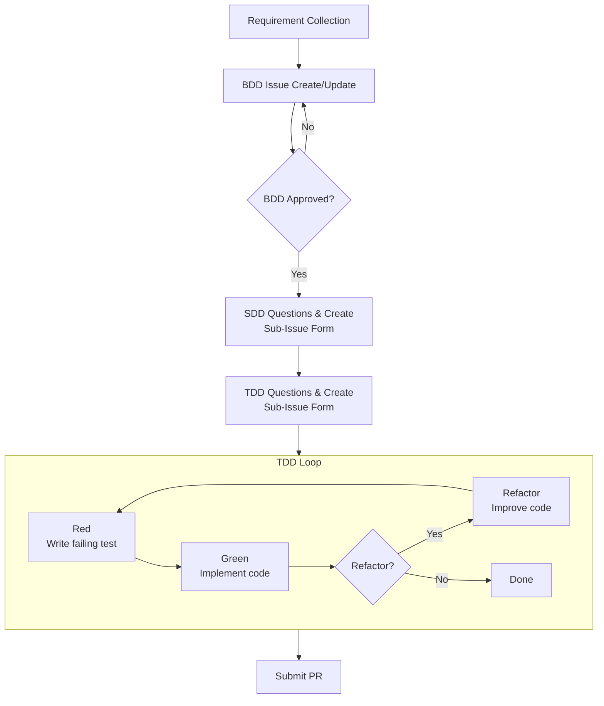

> Note: This page is an AI-generated (gpt-5-mini-2025-08-07) translation from Traditional Chinese and may contain minor inaccuracies.

# 📌 Introduction

In the current AI development landscape, different methodologies are proliferating rapidly (for example `coleam00/context-engineering-intro`, `bmad-code-org/BMAD-METHOD`, `automazeio/ccpm`, and `classmethod/tsumiki`). These methodologies aim to help AI Agents plan before coding. However, they often store the large amount of planning documents directly in the project repo. Although they look detailed, these documents become a burden when requirements keep changing. When requirements change, it's hard to verify whether the AI Agent has correctly read and updated the relevant documents, and difficult to audit and track changes, especially in collaborative environments or when maintaining legacy projects.

<!-- more -->

# 🚀 Initial Idea

This is still in the testing phase; related code can be viewed at [`hsiangjenli/prompts`](https://github.com/hsiangjenli/prompts/tree/v1.0.0). This article is only to record the envisioned development workflow logic. The main focus is on "managing" Issues: testing whether Issues follow the `ISSUE_TEMPLATE`, whether they are correctly linked to related Issues, etc.

## Three Main Problems to Solve

> Requirement collection stage, document management difficulties, chaotic document relationships

|          | As Is | To Be |
| -------- | -------- | -------- |
|**Requirement collection stage**|Most development tools focus on the coding phases (like SDD, TDD) and neglect the front-end "requirements" part. Requirements themselves are the hardest part because developers often don't clearly know what they want, and requirements continue to change during development.|Before starting any coding, we use a Q&A style to let users describe requirements. The AI Agent will progressively clarify the user's requirements and format them as User Stories using GWT (Given-When-Then), ensuring each requirement is clearly described and easy to understand. This not only helps clarify requirements but also provides directly usable test scenarios for future testing.|
|**Document management difficulties**|Many tools store the planning documents produced by AI Agents directly in the Repository. When project requirements keep changing, these files become very messy. Every time an AI Agent generates a bunch of files, developers find it hard to confirm whether it has read the latest requirements or whether it accidentally overwrote existing files. Moreover, these files are hard to audit and track, especially in collaborative projects.|Store all requirement-related documents (such as PRD, user stories, etc.) in GitHub Issues so each requirement has a clear record and can be linked to subsequent code development. After development is complete, PRs can reference the original requirement Issue number.|
|**Chaotic document relationships**|There are many types of requirement documents, such as user stories (BDD), system design descriptions (SDD), unit tests (TDD), etc. When storing all these documents in GitHub Issues, it can easily become messy. You might change one file and forget to update related documents.|GitHub's new "sub-issue" feature allows us to create related sub-issues under a main requirement Issue, such as system design descriptions or unit tests. This provides a clear hierarchy among requirements and makes tracking progress easier. When requirements change, the AI Agent can use GitHub's MCP tool to read and modify related issues and documents together, recording everything on GitHub so all changes can be tracked and audited.|

## Development Workflow Design

### Flowchart

### Prompt List

| Prompt filename | Trigger condition | Main task | Output |
| --- | --- | --- | --- |
| `requirements.prompt.md` | New requirement or requirement analysis stage | Discuss requirements with developers, collect background info | Produce structured requirements |
| `bdd-change.prompt.md` | Requirement changes discovered during BDD/SDD/TDD | Assess impact of changes, update BDD/SDD/TDD Issues layer by layer | Updated requirements, layered update confirmations |
| `sdd.prompt.md` | BDD Issue approved, design questions needed | Clarify system design, interface contracts, data models through questioning | Create SDD Issue (automatically becomes a sub-issue of the BDD) |
| `tdd-requirements.prompt.md` | BDD approved + SDD created, start test planning | Define test scenarios, data preparation, priorities through questioning | Create TDD Issue (automatically becomes a sub-issue of the SDD) + test matrix |
| `tdd-red.prompt.md` | TDD Issue created, start Red phase | Write tests that will fail, record failure details | Corresponding Test status in the test matrix set to 🔴 + separate Comment recording the failure |
| `tdd-green.prompt.md` | Red phase tests established, start Green phase | Implement minimal viable code to pass tests | Append Green phase results in the same Comment, test status set to 🟢 |
| `tdd-refactor.prompt.md` | Green phase tests passed, start Refactor phase (optional) | Improve code quality and maintainability | Append Refactor results in the same Comment, test status set to ♻️ |

# 🔁 Key Takeaways

- After testing many AI development tools, three major issues were found:
   - **Requirement collection stage**: jumping straight to SDD and TDD stages
   - **Document management difficulties**: AI Agents generate many files, all dumped into the repo
   - **Chaotic document relationships**: unclear relationships between tasks and unsure whether the AI Agent updated all related Issues
- Design a workflow blueprint covering requirements (BDD) --> specifications (SDD) --> tests (TDD)
- Consolidate each prompt's main tasks, trigger conditions, and expected outputs

# 🔗 References

- [`coleam00/context-engineering-intro`](https://github.com/coleam00/context-engineering-intro)
- [`bmad-code-org/BMAD-METHOD`](https://github.com/bmad-code-org/BMAD-METHOD)
- [`automazeio/ccpm`](https://github.com/automazeio/ccpm)
- [`classmethod/tsumiki`](https://github.com/classmethod/tsumiki` )
