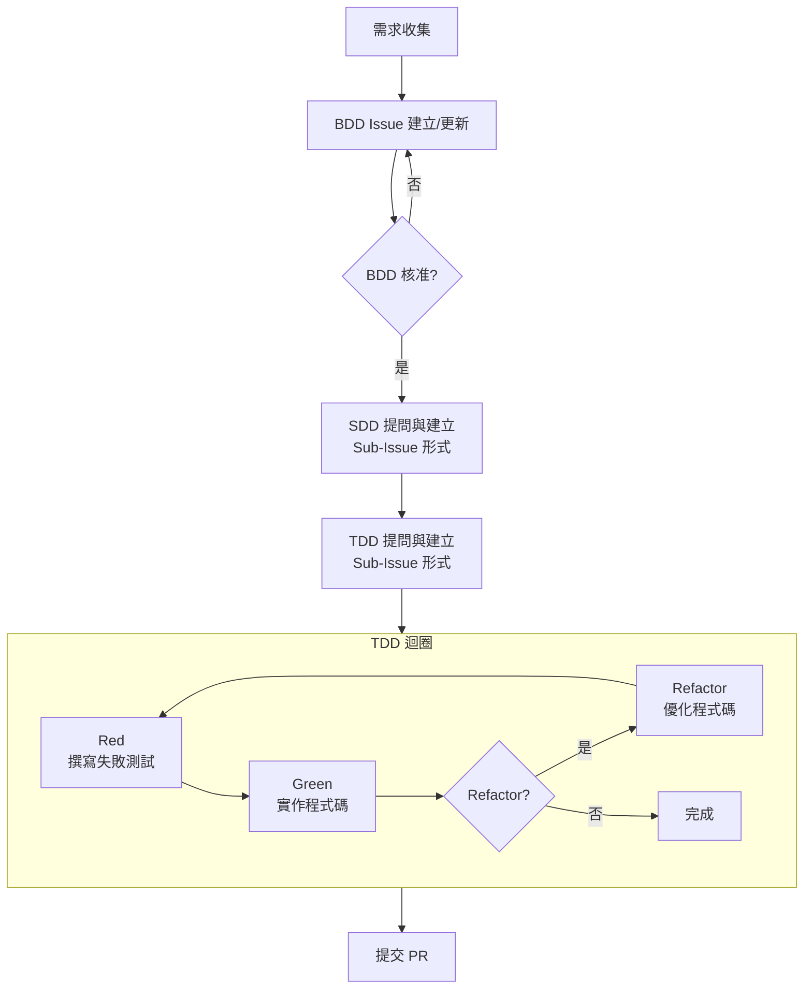

# 📌 簡介

在當前的 AI 開發流程中，不同的方法論如雨後春筍般地快速增長（例如 `coleam00/context-engineering-intro`、`bmad-code-org/BMAD-METHOD`、`automazeio/ccpm` 和 `classmethod/tsumiki`），這些方法論目的是用來協助 AI Agent 在程式開發前進行規劃。然而，這些工具通常會將規劃產生的「大量文件」直接存放在專案的 Repo 中。看起來很詳細，但實際上在需求不斷變動的情況下，這些文件反而成為了負擔。當需求發生變更時，很難確認 AI Agent 是否已正確讀取並更新相關文件，也難以進行審核與追蹤，特別是在多人協作或需要維護舊專案時。

<!-- more -->

# 🚀 初步想法

目前還在測試階段，相關程式碼可以至 [`hsiangjenli/prompts`](https://github.com/hsiangjenli/prompts/tree/v1.0.0) 查看。這篇文章僅用來紀錄預想中的開發流程邏輯。其主要內容著重在「管理」Issue，測試 Issue 的格式是否有按照 `ISSUE_TEMPLATE` 內的模板撰寫、是否有正確關聯到相關 Issue 等等...

## 欲解決的 3 大痛點

> 需求蒐集階段、文件管理不易、文件關係混亂

|          |As Is| To Be |
| -------- | -------- | -------- |
|**需求蒐集階段**|多數開發工具專注於程式開發階段（如 SDD、TDD），卻忽略了最前端的「需求」部分。需求本身就是最難的部分，因為開發者往往不明確自己到底要什麼，而且需求在開發過程中會持續改變|在開始任何程式開發前，我們會使用一個問答式的方式，讓使用者描述需求。AI Agent 會逐步釐清使用者的需求，並將其以 GWT（Given-When-Then） 格式化為 User Story，確保每個需求都描述得清晰且易於理解。這樣不僅有助於明確需求，也為未來的測試提供了直接可用的測試情境|
|**文件管理不易**|許多工具會將 AI Agent 產生的規劃文件直接存在 Repository 中。當專案需求不斷變動時，這些文件會變得非常混亂。每次 AI Agent 產生一大堆文件，開發者很難確認它是否已讀到最新的需求，或者是否不小心改寫了已有的文件。此外，這些文件也很難進行審核與追蹤，特別是在多人協作|將所有需求相關的文件（如 PRD、使用者故事等）都存放在 GitHub Issue 中，讓每個需求都有明確的記錄，並可以與後續的程式碼開發關聯。當開發完成後，也可以透過 PR 來連結回原始的需求 Issue 號碼|
|**文件關係混亂**|需求文件有許多種類，例如使用者故事（BDD）、系統需求描述（SDD）、單元測試（TDD）等。將這些文件都存在 GitHub Issue 中時，很容易變得一團亂。改個其中一個文件，卻忘記修與其關聯的文件檔|GitHub 新增的「sub-issue」功能，可以讓我們在一個主要的需求 Issue 下，建立相關的 sub-issue，例如系統需求描述或單元測試等。這樣不僅可以讓所有需求之間有清晰的層級關係，還可以方便地追蹤每個部分的進度。當需求發生變更時，AI Agent 可以透過 GitHub 的 MCP 工具，一起讀取並修改相關的問題與文件，並統一記錄在 GitHub 上，確保所有改動都可以被追蹤和審核|

## 開發流程設計

### 流程圖

### Prompt 列表

| Prompt 檔名 | 觸發條件 | 主要任務 | 產出物 |
| --- | --- | --- | --- |
| `requirements.prompt.md` | 新需求或需求分析階段 | 與開發人員討論需求，收集背景資訊 | 產出結構化需求 |
| `bdd-change.prompt.md` | 需求在 BDD/SDD/TDD 中途發現變更 | 評估變更影響範圍，逐層更新 BDD/SDD/TDD Issue | 更新需求，逐層更新確認 |
| `sdd.prompt.md` | BDD Issue 已核准，需進行設計提問 | 透過提問釐清系統設計、界面契約、資料模型 | 建立 SDD Issue（自動成為 BDD 的 Sub-Issue） |
| `tdd-requirements.prompt.md` | BDD 已核准 + SDD 已建立，開始測試規劃 | 透過提問定義測試場景、資料準備、優先順序 | 建立 TDD Issue（自動成為 SDD 的 Sub-Issue） + 測試矩陣 |
| `tdd-red.prompt.md` | TDD Issue 已建立，開始 Red 階段 | 撰寫一定會失敗的測試，記錄失敗詳情 | 測試矩陣中對應 Test 狀態改為 🔴 + 獨立 Comment 記錄失敗 |
| `tdd-green.prompt.md` | Red 階段測試已建立，開始 Green 階段 | 實作最小可行程式碼讓測試通過 | 在同一 Comment 中追加 Green 階段結果，測試狀態改為 🟢 |
| `tdd-refactor.prompt.md` | Green 階段測試已通過，開始 Refactor 階段（可選） | 優化程式碼品質、提升可維護性 | 在同一 Comment 中追加 Refactor 結果，測試狀態改為 ♻️ |

# 🔁 重點回顧

- 在測試過大量的 AI 開發工具後發現的了 3 大問題
   - **需求蒐集階段**：直接跳到 SDD、TDD 階段
   - **文件管理不易**：AI Agent 產出一堆文件檔，卻全部塞在 Repo 底下
   - **文件關係混亂**：搞不清楚每個 Task 之間的關係，也不知道 AI Agent 是否有修改到所有關聯 Issue
- 設計一組流程，從需求（BDD）-->規格（SDD）-->測試（TDD）整個開發步驟的藍圖
- 統整每個 prompt 的主要任務、觸發條件以及預期產出 

# 🔗 參考資料

- [`coleam00/context-engineering-intro`](https://github.com/coleam00/context-engineering-intro)
- [`bmad-code-org/BMAD-METHOD`](https://github.com/bmad-code-org/BMAD-METHOD)
- [`automazeio/ccpm`](https://github.com/automazeio/ccpm)
- [`classmethod/tsumiki`](https://github.com/classmethod/tsumiki)
